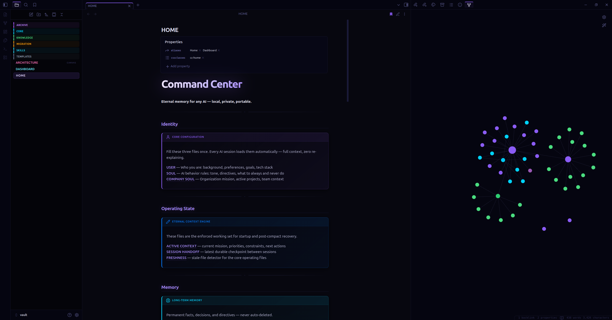
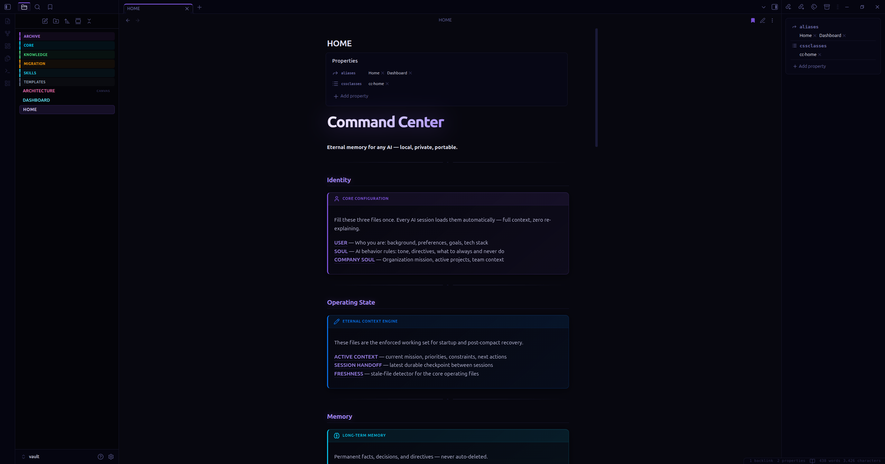
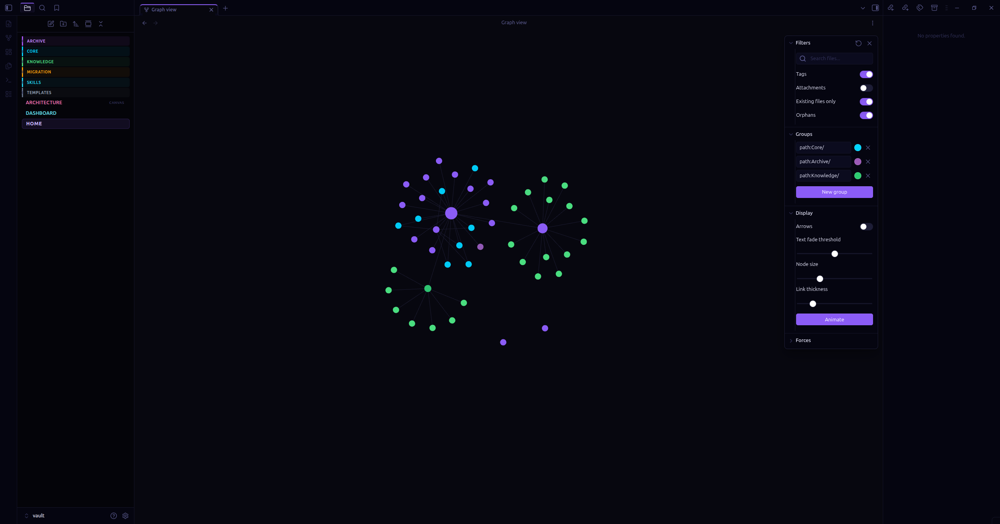

<div align="center">


### Eternal Memory for Any AI — Local, Private, Portable

[](https://python.org)
[](https://modelcontextprotocol.io)
[](https://lancedb.com)
[](LICENSE)
[](https://obsidian.md)
[](CONTRIBUTING.md)

</div>

Your AI shouldn't start from scratch every session. Command Center gives any AI tool permanent, searchable memory stored as Markdown files you can read, edit, and browse in Obsidian.

**Works with**: Claude Desktop, Claude Code, Cursor, Zed, Gemini CLI, OpenClaw, or any MCP-compatible AI.

> No cloud. No subscriptions. No lock-in. Your context lives on your machine — or on a USB drive.

---

## The Problem: The Longer the Conversation, the Worse the AI Gets

Every AI has this problem — Claude, GPT, Gemini, Grok, Codex, all of them. The longer a conversation runs, the more the model degrades. It forgets decisions. It contradicts itself. It loses track of your architecture, your constraints, what you already ruled out. The hallucinations get more frequent, not less. You spend more time correcting than building.

When the conversation gets long enough, the provider compacts it — silently replacing your entire history with a summary. Suddenly your AI has no idea what you were building or why.

Understanding *why* this happens — what compaction actually is, what gets lost and why the AI can't tell — is covered in full in [Bootstrap — Surviving Compaction](#bootstrap--surviving-compaction).

**Command Center was built to fix this permanently.** Your context lives in your vault, not in the conversation. The AI is always grounded to what's actually true — regardless of how long the conversation runs, how many times it compacts, or which AI you're using. No re-explaining. No re-hallucinating. No momentum lost.

---

## What It Does

```
Your Notes (Markdown)  →  Vault (Obsidian Graph View)
         ↓
    Engine indexes with LanceDB (local vector DB)
         ↓
  MCP Server / REST API  →  Any AI on your machine or network
         ↓
  AI remembers you. Every session. Across machines.
```

- **Write notes in Markdown** → Engine indexes them automatically
- **AI searches your vault** via MCP or REST API — gets relevant context instantly
- **Visualize your knowledge** in Obsidian's Graph View as it grows
- **Migrate in 60 seconds** — copy folder, reinstall deps, reindex

---

## Quick Start

```bash
# 1. Clone
git clone https://github.com/KCommader/Command-Center-AI-Eternal-Context-Engine
cd Command-Center-AI

# 2. Setup (creates venv, installs deps, scaffolds vault)
bash setup.sh

# 3. Fill in your identity
# Edit: vault/Core/USER.md, vault/Core/SOUL.md, vault/Core/COMPANY-SOUL.md

# 4. Start the engine
python engine/omniscience.py start

# 5. Connect your AI (see below)
```

**One-command setup** — writes the right MCP config for your AI runtime automatically:
```bash
python engine/omniscience.py setup-ai claude-code      # Claude Code
python engine/omniscience.py setup-ai claude-desktop   # Claude Desktop
python engine/omniscience.py setup-ai cursor           # Cursor
python engine/omniscience.py setup-ai zed              # Zed
```

After `setup-ai`, your AI reads `CLAUDE.md` at startup and calls `bootstrap_agent(reason="session_start")` automatically. Compaction becomes a non-event.

> Manual MCP config snippets are in [Connecting Your AI](#connecting-your-ai) below.

---

## Connecting Your AI

### Option A — MCP (Recommended for Claude, Cursor, Zed)

MCP is Anthropic's open protocol. Any MCP-compatible AI gets your vault as tools + resources automatically.

**Claude Desktop** (`~/.config/claude/claude_desktop_config.json`):
```json
{
  "mcpServers": {
    "command-center": {
      "command": "python",
      "args": ["/absolute/path/to/Command-Center-AI/engine/mcp_server.py"],
      "env": {
        "OMNI_VAULT_PATH": "/absolute/path/to/Command-Center-AI/vault",
        "OMNI_ENGINE_URL": "http://127.0.0.1:8765"
      }
    }
  }
}
```

**Claude Code** (`.claude/mcp_config.json` in your project):
```json
{
  "mcpServers": {
    "command-center": {
      "command": "python",
      "args": ["/absolute/path/to/Command-Center-AI/engine/mcp_server.py"]
    }
  }
}
```

Once connected, the AI gets these tools automatically:
- `search_memory` — semantic search across your vault
- `store` — save facts/decisions (engine auto-classifies into the right memory tier)
- `read_vault_file` — read any vault document
- `list_vault` — browse available notes
- `list_skills` — list all skills available in the vault
- `read_skill` — load a specific skill prompt on demand
- `resolve_skills` — auto-detect which skills are relevant to the current task
- `bootstrap_agent` — recover full context after provider compaction (see Bootstrap section)
- `update_working_set` — pin the files and context most relevant to active work
- `record_handoff` — write a durable session summary before ending a session
- `verify_vault_file` — confirm a vault file exists and is readable
- `freshness_report` — show when each core context file was last updated
- `sync_skills` — sync vault skills to any connected AI runtime (Claude, Gemini, Codex)

### Option B — Network MCP via Streamable HTTP (NAS / Multi-Machine)

**Why this exists**: stdio requires the MCP server to run on the same machine as the AI.
If you have a NAS or home server, run one Command Center instance and connect every machine on your network to the same vault. One memory. Shared everywhere.

**On your NAS/server:**
```bash
OMNI_MCP_KEY=your_secret_token \
OMNI_VAULT_PATH=/path/to/vault \
OMNI_ENGINE_URL=http://127.0.0.1:8765 \
python engine/mcp_server.py --transport http --port 8766
```

**On every client machine** (`~/.claude/settings.json`):
```json
{
  "mcpServers": {
    "command-center": {
      "url": "http://YOUR_NAS_IP:8766/mcp",
      "headers": { "Authorization": "Bearer your_secret_token" }
    }
  }
}
```

> **Security**: The engine already has role-based Bearer tokens (read/write/admin). Add `OMNI_MCP_KEY` for the MCP HTTP layer too. Keep the engine on `localhost` — only the MCP server needs to be LAN-accessible.

### Option C — REST API (For scripts and bots)

```bash
# Start engine
python engine/omniscience.py start

# Search your vault
curl -X POST "http://127.0.0.1:8765/search" \
  -H "Content-Type: application/json" \
  -d '{"query": "my trading strategy", "k": 5}'

# Store a memory
curl -X POST "http://127.0.0.1:8765/capture" \
  -H "Content-Type: application/json" \
  -d '{"content": "User prefers Python over Node for data pipelines"}'
```

---

## Vault Structure

```
vault/
├── Core/
│   ├── USER.md          ← Who you are (fill this in)
│   ├── SOUL.md          ← AI identity & behavior rules (fill this in)
│   └── COMPANY-SOUL.md  ← Organization/project mission (fill this in)
├── Knowledge/           ← Your domain notes (strategies, docs, research)
└── Archive/
    └── MEMORY.md        ← Auto-captured facts and decisions
```

The three Core files are your foundation. Fill them in once and every AI session starts with full context.

---

## Bootstrap — Surviving Compaction

**What compaction actually is**

Every AI runs on a context window — a hard limit on how much text the model can hold in working memory at once. Claude's is 200,000 tokens. GPT-4's is 128,000. When a long conversation approaches that limit, the provider has a problem: there's no more room.

So they compact. The provider takes your entire conversation history and replaces it with a summary — automatically, silently, without asking. The specific code you shared becomes "user shared some code." The architecture decision you locked in becomes "user discussed project structure." The constraint you set becomes "user mentioned some requirements."

The AI doesn't know what was lost. It works from the summary as if it were the full picture — and fills the gaps with hallucination. That's why it suddenly contradicts decisions you made earlier, suggests approaches you already ruled out, or acts like it's meeting your project for the first time. It's not malfunctioning. It literally no longer has access to what you said.

Bootstrap solves this by giving the AI a source of truth that lives outside the conversation:

```
bootstrap_agent(reason="session_start")
```

The engine reads your Core identity files, your active session handoff, and your working set — then hands the AI everything it needs to resume. Not a summary of a summary. The actual files you wrote.

**Automatic wiring** — `setup-ai` writes `CLAUDE.md` into your project, which Claude Code reads at startup and calls bootstrap automatically. For other runtimes, add this to your system prompt or session opener:

```
At the start of every session: call bootstrap_agent(reason="session_start") before anything else.
```

The three state files bootstrap reads — updated by your AI throughout each session:
- `vault/Core/SESSION_HANDOFF.md` — what was just done, what comes next
- `vault/Core/ACTIVE_CONTEXT.md` — current working set and project state
- `vault/Core/FRESHNESS.md` — timestamp snapshot of when each file was last updated

Call `record_handoff` at the end of any meaningful session. Call `bootstrap_agent` at the start of the next one.

---

## App Mode (Background Process)

```bash
python engine/omniscience.py start --vault ./vault   # Start in background
python engine/omniscience.py status                   # Check status
python engine/omniscience.py logs --lines 50          # View logs
python engine/omniscience.py stop                     # Stop
python engine/omniscience.py doctor                   # Health check
```

---

## Obsidian — The Intended Interface

**[Install Obsidian](https://obsidian.md) (free), open the `vault/` folder as a vault.** Not the repo root — the `vault/` subfolder.

The repo ships a complete `.obsidian/` config inside `vault/` with everything pre-wired:

| What's included | What it does |
|---|---|
| `HOME.md` | Dashboard landing page — live memory stats via Dataview, quick links to all core files |
| `ARCHITECTURE.canvas` | Visual diagram of the full system: vault → engine → MCP → AI tools |
| `snippets/command-center.css` | Electric blue accent (#00d4ff), custom callout types per memory tier, Dataview table polish |
| `graph.json` | Color groups tuned for the vault: Core=blue, Archive=purple, Knowledge=green |
| `bookmarks.json` | HOME.md and ARCHITECTURE.canvas pinned in the sidebar |
| `Templates/` | Note templates for Knowledge entries and Decision Logs |

**First thing to do after opening the vault:** Install the [Dataview](https://blacksmithgu.github.io/obsidian-dataview/) community plugin (Settings → Community plugins → Browse → "Dataview"). HOME.md uses it for live memory queries — without it, queries show as code blocks.

> The vault is plain Markdown. Everything works without Obsidian. But the graph view watching your memory grow in real time is the whole experience.

---

## Screenshots

<div align="center">



*HOME.md dashboard alongside the live knowledge graph — your memory growing in real time.*

| Dashboard (HOME.md) | Knowledge Graph |
|---|---|
|  |  |

</div>

---

## Skills — Universal Across All AIs

Skills are Markdown prompt libraries that live in `vault/Skills/`. Any connected AI can load them on demand — and the skill adapter syncs them to each AI's native format automatically.

```
vault/Skills/          →  ~/.claude/skills/         (Claude Code)
                       →  ~/.gemini/skills/          (Gemini CLI)
                       →  ~/.codex/skills/           (Codex)
                       →  workspace/skills/*/SKILL.md (OpenClaw)
```

```bash
# Sync all vault skills to every connected runtime
python engine/omniscience.py sync-skills

# Sync to a specific runtime only
python engine/omniscience.py sync-skills --runtime claude

# Preview without writing
python engine/omniscience.py sync-skills --dry-run
```

Or via MCP: `sync_skills({ "runtimes": ["claude", "gemini"] })`

**Writing a skill** — drop a `.md` file in `vault/Skills/` with this frontmatter:

```markdown
---
type: skill
trigger: my-skill-name
description: What this skill does
targets: [claude, gemini, codex]
---

# My Skill
... the prompt content the AI loads ...
```

The vault is the source of truth. Runtimes are output targets, never edited directly.

---

## Migrating to a New Machine

```bash
# 1. Copy the entire Command-Center-AI folder (vault/ included)
# 2. On new machine:
bash setup.sh
python engine/omniscience.py start
# Done. LanceDB rebuilds from Markdown in seconds.
```

Or put it on a USB drive. Runs anywhere Python runs.

---

## Memory Tiers — How Storage Works

Command Center stores memory in three tiers automatically. You never classify manually — the engine's classifier reads the content and decides.

| Tier | Location | TTL | What goes here |
|------|----------|-----|----------------|
| **cache** | `vault/Cache/session-YYYY-MM-DD.md` | Cleared nightly | Greetings, one-off questions, session noise |
| **short_term** | `vault/Archive/short/YYYY-MM-DD.md` | 30 days | Active tasks, project state, in-progress work |
| **long_term** | `vault/Archive/MEMORY.md` | Never expires | Preferences, decisions, identity rules, directives |

**How classification works** (`engine/memory_classifier.py`):
- Force keywords override everything: `"remember this"`, `"never forget"`, `"permanent"` → always long_term
- Pattern matching scores content across all three tiers
- Long-term signals: `always`, `never`, `decided`, `from now on`, `my wallet`, `tech stack`
- Short-term signals: `working on`, `current task`, `blocked`, `this sprint`, `backtest result`
- Cache signals: greetings, `just checking`, `show me`, `today`
- Longest match wins; no signal defaults to short_term (better to keep than lose)
- Very short content (<4 words) → cache; long structured content (>30 words, 3+ sentences) → boosts long_term

**The AI calls `store("content")` — classifier routes it. That's the whole interface.**

---

## Nightly Maintenance

Auto-cleanup and health checks every night (prevents memory bloat):

```bash
chmod +x engine/install_nightly_timer.sh
bash engine/install_nightly_timer.sh
```

What it does:
- **Engine health check** — runs `doctor` to verify vault + index are healthy
- **Admin cleanup** — calls engine's `/admin/cleanup` endpoint if engine is running
- **Cache purge** — deletes all files in `vault/Cache/` (session noise, not worth keeping)
- **Short-term expiry** — removes files in `vault/Archive/short/` older than 30 days (configurable via `--short-term-ttl`)
- **Freshness snapshot** — updates `vault/Core/FRESHNESS.md` so bootstrap always knows current state
- Logs everything to `.omniscience/nightly.log`

---

## API Reference

| Endpoint | Method | Description |
|---|---|---|
| `/health` | GET | Engine status and vault stats |
| `/search` | POST | Semantic search with optional namespace filter |
| `/capture` | POST | Store a memory entry |
| `/admin/reindex` | POST | Force full reindex (admin key required) |
| `/admin/cleanup` | POST | Run cleanup (admin key required) |

### Auth (Optional)

```bash
export OMNI_API_KEY="your-secret-token"

curl -H "Authorization: Bearer $OMNI_API_KEY" ...
```

For LAN/network use, split read/write/admin tokens:
```bash
export OMNI_API_KEYS_READ="read_token"
export OMNI_API_KEYS_WRITE="write_token"
export OMNI_API_KEYS_ADMIN="admin_token"
```

---

## Architecture

| Component | Why | What |
|---|---|---|
| `vault/` | Human-readable, Obsidian-native | Markdown source of truth |
| `engine/engine.py` | One process for index + API | Watches vault, embeds, serves search |
| `engine/memory_classifier.py` | Auto memory routing | Rule-based tier classifier — no LLM needed, ~1ms |
| `.lancedb/` | Fast local vector search | Like SQLite but for vectors — auto-built, never touch manually |
| `engine/mcp_server.py` | Universal AI connector | MCP protocol, two transports: stdio (local) + HTTP (network) |
| `engine/omniscience.py` | App-like UX | start/stop/status/doctor/logs/sync-skills |
| `engine/nightly_maintenance.py` | Anti-bloat | Cache purge + short-term TTL expiry + health check |
| `engine/context_state.py` | Anti-compaction | Reads/writes SESSION_HANDOFF, ACTIVE_CONTEXT, FRESHNESS — bootstrap recovery packet |
| `engine/skill_adapter.py` | Universal skills | Syncs vault/Skills/ to Claude, Gemini, Codex, OpenClaw native formats |

**Key design decisions:**
- **Markdown is the source of truth** — all memory lives in `.md` files you can read, edit, and open in Obsidian. LanceDB is the auto-generated search index, never the source.
- **The AI never picks the memory tier** — `memory_classifier.py` does it based on content patterns. Keeps memory clean without requiring the AI to make judgment calls.
- **Vault is air-gapped** — engine only listens on `127.0.0.1`. Nothing from the internet reaches your memory directly. Even browser automation results flow through you before anything gets stored.
- **Role-based auth** — separate Bearer tokens for read/write/admin. Give each agent only the access it needs.
- **Two MCP transports** — stdio spawns the server locally (zero config, works instantly). Streamable HTTP runs the server on a NAS and serves any machine on your LAN from one vault.

- **Embedding model**: `BAAI/bge-small-en-v1.5` — 100% local, ~130MB, ~50ms/doc
- **Vector DB**: LanceDB — embedded, disk-based, no server needed
- **API**: FastAPI on `localhost:8765`
- **MCP transports**: stdio (local, zero-config) + Streamable HTTP (NAS/network, Bearer auth)

---

## Scripts

`scripts/` contains standalone tools and examples that work alongside the engine but aren't part of the core memory system.

- **`scripts/browser_test.py`** — Example of using `browser-use` with the Anthropic API to give your AI a real browser. The AI can navigate pages, extract data, and fill forms. Results are returned to you — nothing is stored in the vault automatically (prompt injection protection).

  ```bash
  ANTHROPIC_API_KEY=your_key .venv/bin/python scripts/browser_test.py
  ```

  Swap the task string for anything: check prices, read dashboards, monitor pages. Uses Claude Haiku by default (cheapest). Change to `claude-sonnet-4-6` or `claude-opus-4-6` for harder tasks.

> Add your own scripts here. Keep personal/sensitive scripts in subdirectories listed in `.gitignore`.

---

## License

**Dual License — AGPL v3 / Commercial**

- **Free use** (personal, research, open source): [AGPL-3.0](LICENSE) applies. You must open-source any modifications or derivative services.
- **Commercial use** (proprietary products, SaaS, closed-source): requires a separate commercial license from KCommander. [Open an issue](https://github.com/KCommader/Command-Center-AI-Eternal-Context-Engine/issues) to inquire.
- **Contributors**: by submitting a PR you assign copyright to KCommander (see [LICENSE](LICENSE)). This is required to maintain dual-licensing rights.

Copyright © 2026 KCommander. All rights reserved.

---

## Contributing

Issues and PRs welcome. The goal is a simple, portable, powerful memory layer — keep it lean.

See [CONTRIBUTING.md](CONTRIBUTING.md) for ideas on where to contribute and the core principles (portable, Markdown-first, no lock-in). If it pushes the mission forward, it belongs here.
